## Stakeholders

O cliente deseja uma ferramenta que auxilie cada usuário a acompanhar as séries televisivas de seu interesse. Todo usuário poderá criar um perfil próprio, após preencher alguns dados no formulário, a conta será criada e o usuário usará seu email e sua senha para acessá-la. Através de sua conta o usuário poderá selecionar as séries que acompanha no momento ou que tem intenção de acompanhar, após a seleção ele será notificado sobre novos episódios e poderá visualizar seu progresso em cada série marcada. O usuário também terá a opção de visualizar um calendário (mensal ou semanal) contendo os lançamentos de seu interesse.

Para resolver o problema do cliente a equipe de desenvolvedores produzirá um sistema web utilizando o framework Ruby on Rails e as linguagens de programação Ruby, HTML5 e CSS3. Para hospedar o sistema em nuvem teremos o serviço de hospedagem Heroku e o sistema de gerenciamento PostgreSQL para banco de dados. Como não é necessária uma interface rebuscada, o layout será implementado utilizando Bootstrap, de modo que o sistema seja simples e eficiente. O processo de desenvolvimento será feito de forma iterativa e incremental seguindo preceitos da metodologia ágil.

Os futuros usuários do sistema poderão acompanhar suas séries preferidas de maneira mais fácil. Receber alertas sobre episódios novos garante que não esqueçam de assisti-los e podem se programar para futuros lançamentos pelo calendário. Poderão também acompanhar seu progresso, com isso não esquecem em qual episódio pararam e ficam cientes de quanto tempo falta para assistem todos os episódios e temporadas desejadas. Ideal para fãs de seriados que querem organizar-se e manter-se bem informados.

---

## Arquitetura

Para atender a demanda do cliente e dos usuários, a equipe de desenvolvedores utilizou as tecnologias WEB como HTML 5, CSS 3, JavaScript, Ruby e o Framework Rails. A SerieFlix está hospedada nos servidores em nuvem do Heroku, que utiliza o banco de dados Postgres.

A arquitetura do servidor WEB utilizada foi o MVC (Model-View-Controller). A arquitetura MVC é uma das mais antigas e mais utilizadas atualmente, ela possibilita a divisão do projeto em camadas com responsabilidades muito bem definidas:

- model: possui a responsabilidade de se comunicar com o banco de dados e atender requisições do controller. O model faz parte da camada de persistência que, no nosso projeto, foi utilizado o padrão Active Record, no qual as tabelas do banco de dados relacional são representadas como classes e as linhas da tabela são objetos dessas classes e qualquer recuperação, criação, atualização e exclusão de objetos deve também ser refletida no banco de dados.

- view: possui a responsabilidade de exibir os dados ao usuário que solicitou alguma coisa. É a camada que o usuário interage, geralmente é composta por arquivos HTML, de estilo CSS e de alguma linguagem de script, como JavaScript.

- controller: possui a responsabilidade de processar as requisições do usuário. Ele acessa o model para solicitar dados do banco de dados, encapsula as informações e manda a resposta para a camada view, que apresenta ao usuário o resultado da sua solicitação.

---

## Histórias de Usuário, Pontuação e Cenários

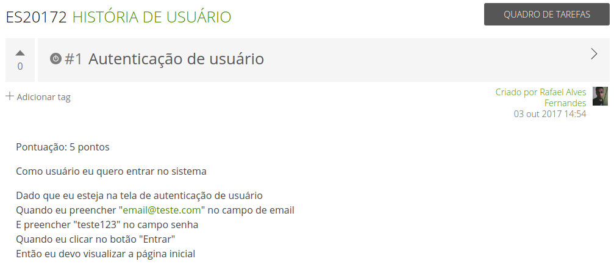

---

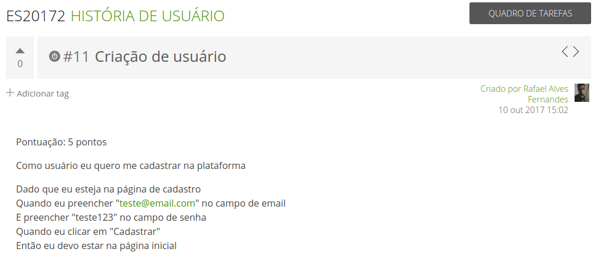

---

---

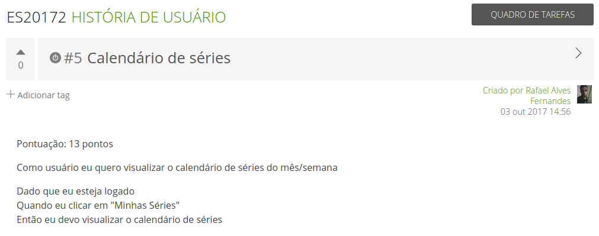

---

---

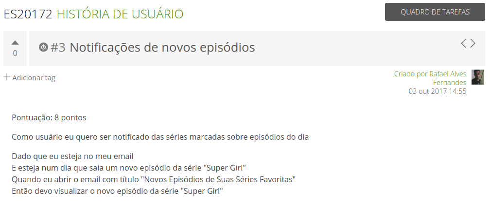

---

---

## MVP

O MVP do projeto pode ser utilizado no link: https://serieflixbr.herokuapp.com/

---

## Backlog

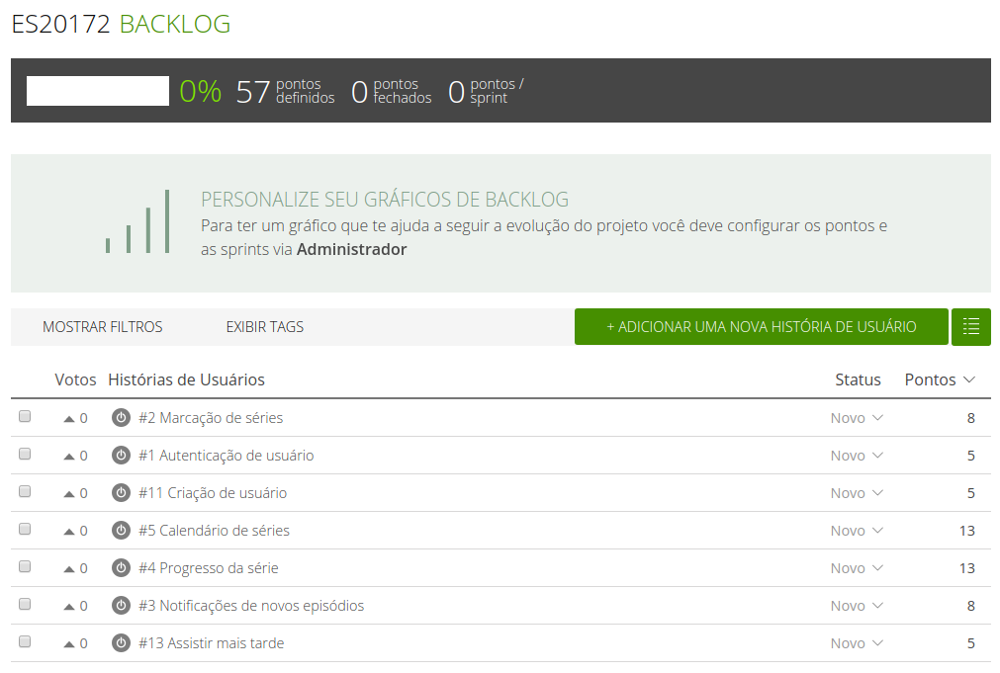

---

## Planejamento das Iterações

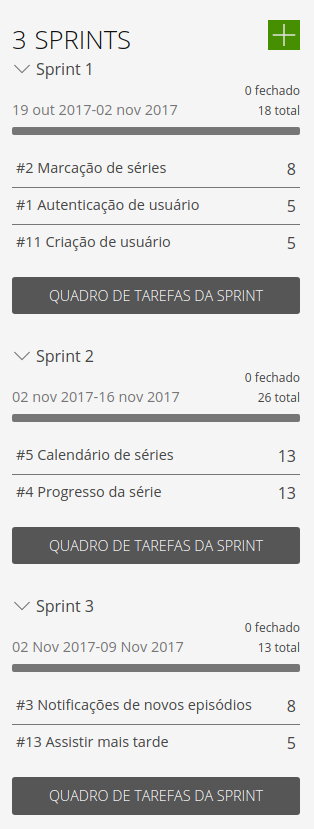

---

## Telas e Protótipos

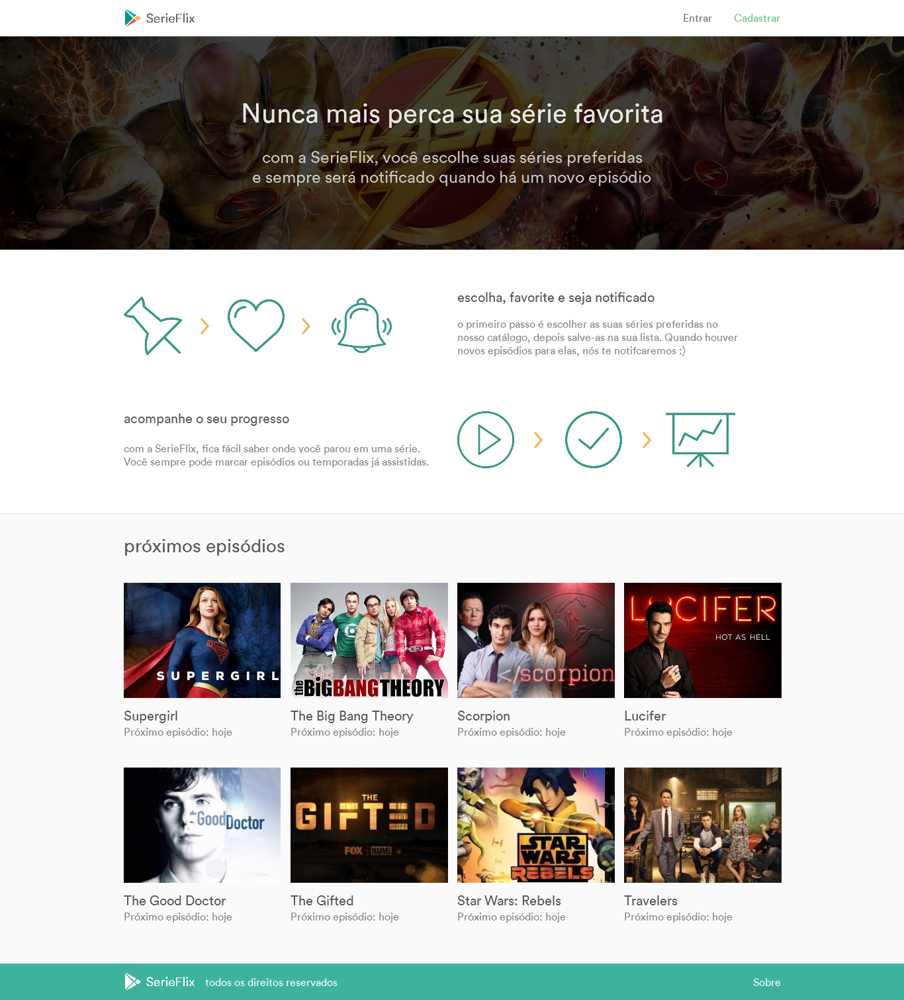

---

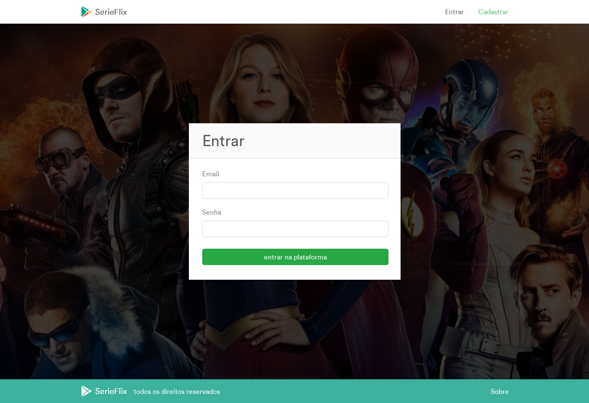

---

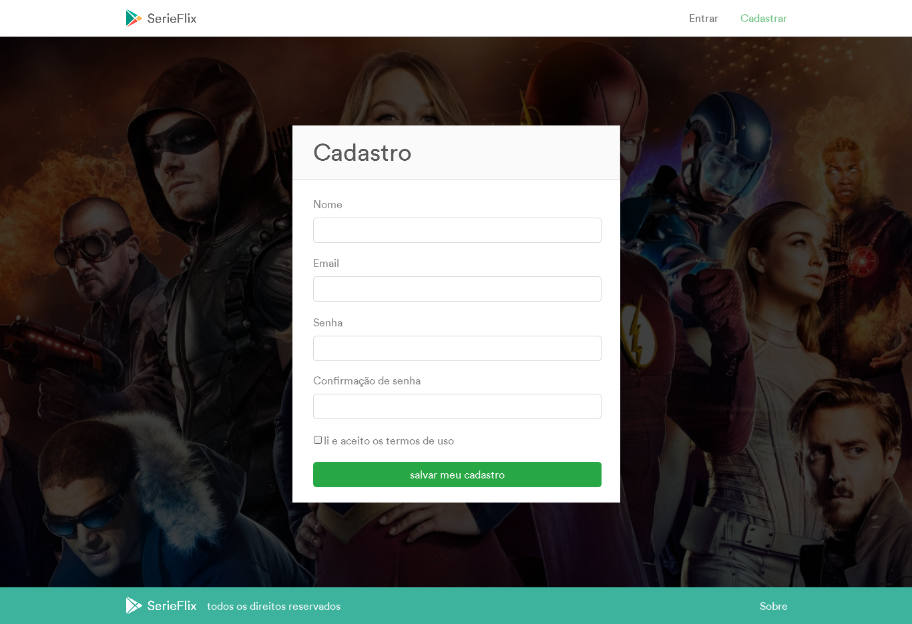

---

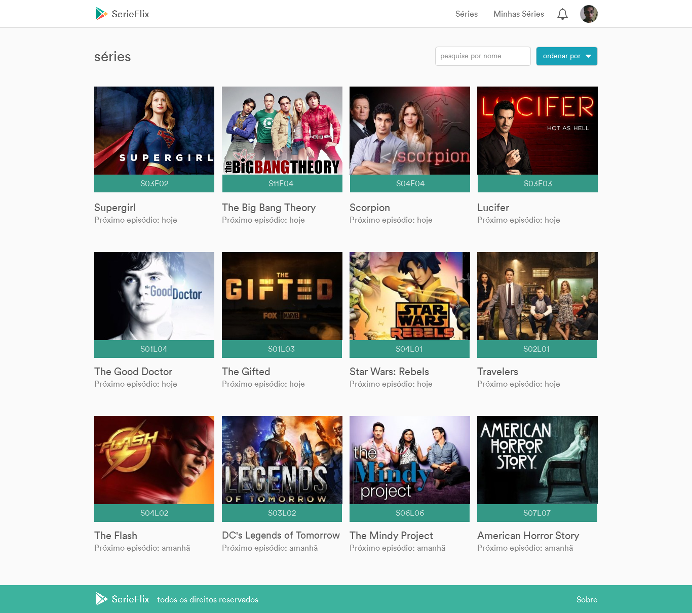

---

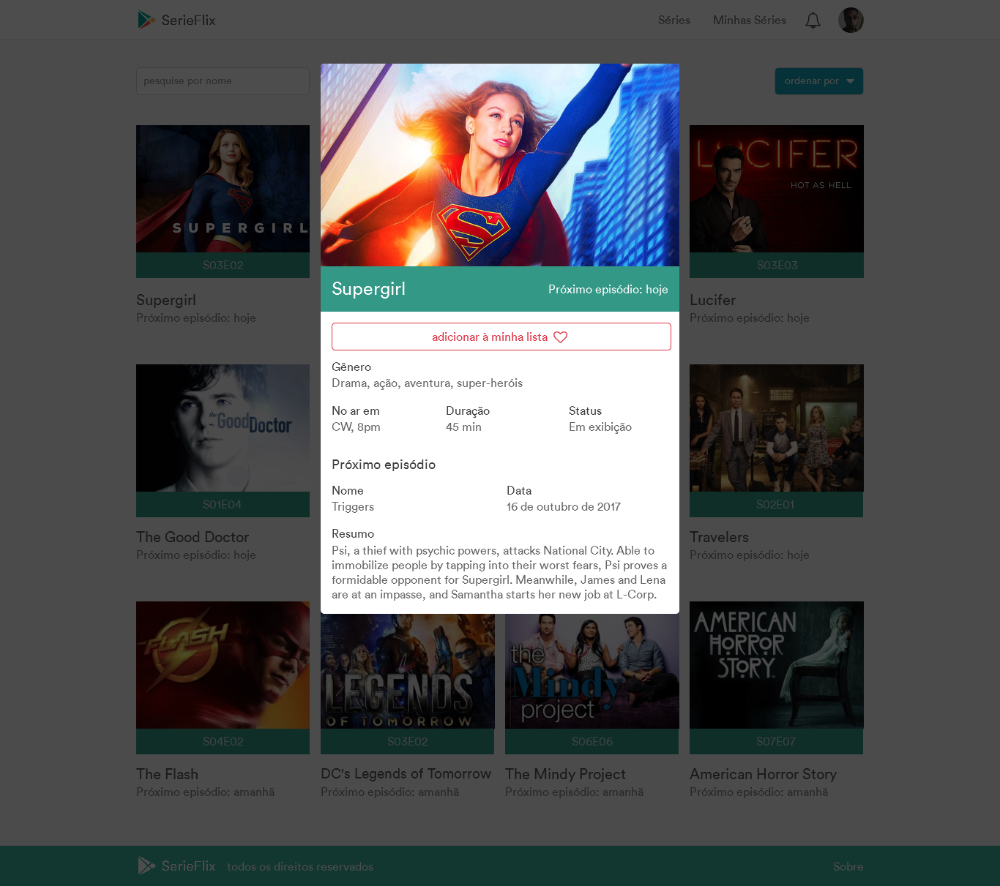

---

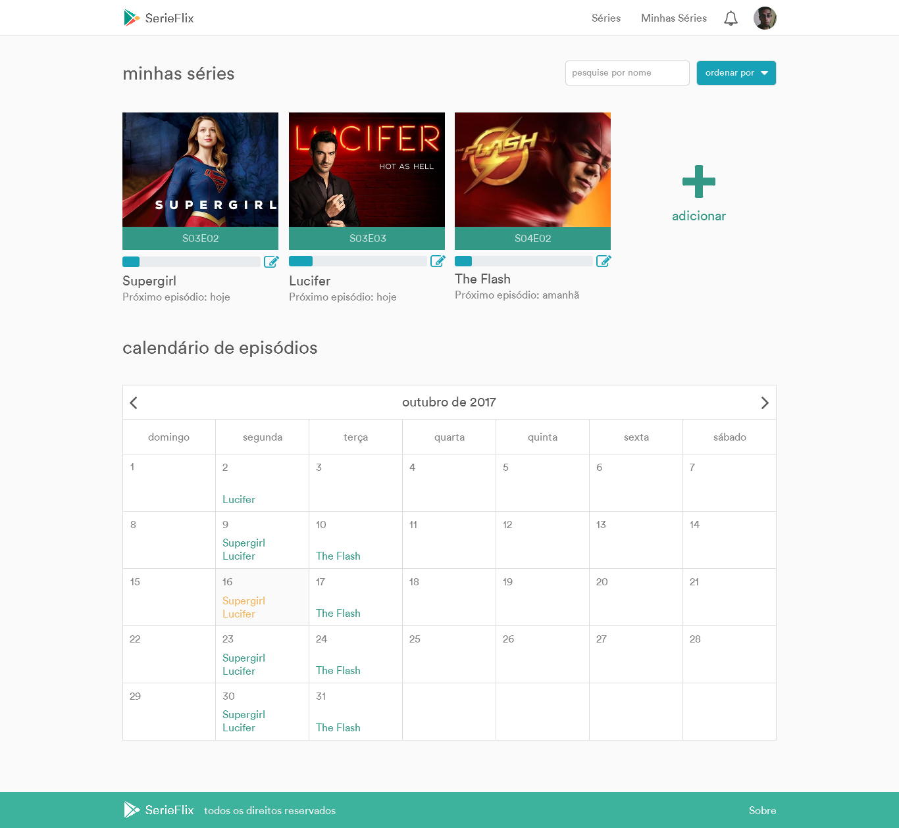

---

---

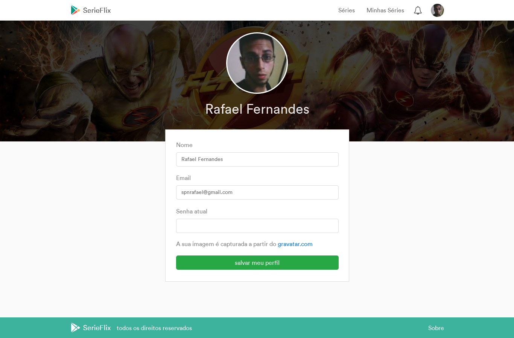

---

## Storyboard

O storyboard do projeto pode ser encontrado nesse link: https://xd.adobe.com/view/af694e06-a62e-4afa-968b-22f9acab67c5/

---

## Matriz de Rastreabilidade

---

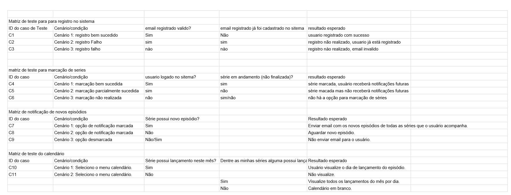

---

## Testes de Unidade
   Os testes foram feitos com a ferramenta Cucumber. Este aplicativo permite que se realize testes de aceitação e foi desenvolvido originalmente para Ruby. Para instalação é preciso que se possua o Ruby on Rails em seu computador pois os comandos são efetuados no terminal do Rails. Assim é possível instalar o cucumber com o comando "gem install cucumber".
No entanto o cucumber necessita de outras ferramentas de suporte como o watir, rspec e capybara que podem ser instaladas com o comando "gem install rspec". 

---

## Cobertura dos Testes de Unidade
   Os testes funcionam da seguinte forma: cria-se um arquivo de extensão .feature que será processado pelo cucumber. A estrutura desse arquivo deve ser constituída de um cabeçalho com a indicação "feature:" e "scenario:". Abaixo deve ser indicado a estrutura Given, When, Then. 

---

## Testes de Validação

---

## Execução dos Testes
   Executamos um teste com o arquivo .feature. Nesse teste o Scenario: login e tínhamos Given: Eu estou na tela de login 
---

## Uso de Técnicas

---

## Decisões de Projeto
Obs: Como o cliente já havia deixado bastante claro como ele queria o produto, a maior parte das decisões tomadas foram de gerenciamento, como a divisão de tarefas por exemplo.

1) No meio do projeto foi verificado a não necessidade de incluir filmes para serem acompanhados devido ao fato de filmes não ser algo que você assiste novos episódioss periodicamente como séries. Essa decisão foi apoiada pelo cliente.

2) Para testes decidimos fazer mais de um tipo. Majoritariamente BDD com Tdd somente onde o rails não nos fornece features já prontas.

---

## Lições Aprendidas

Houveram pequenos desvios durante o andamento do projeto, algumas sprints não conseguiram ser entregues dentro do prazo, porém nada muito significativo. Estes desvios aconteceram porque algumas tarefas foram subestimadas e outras superestimadas. Alguns poderiam ter sido evitados prevendo melhor a dificuldade das tarefas e nos planejando melhor, mas em certos casos nós não conseguimos fazer esta previsão por falta de experiência e não por falta de atenção.

Outro problema foi a falha de comunicação entre a equipe, em uma ocasião um desenvolvedor entendeu incorretamente uma funcionalidade e esta precisou ser refeita. Ocorreu uma mudança no plano do projeto após o início da execução. Originalmente o sistema deveria lidar com filmes e séries, depois de conversar com o cliente decidimos remover os filmes porque não fazia sentido para a ideia do projeto, portanto a equipe decidiu que seria melhor se fossem usadas somente séries de tv. Algumas funcionalidades são mais complexas do que parecem ser portanto é preciso ter mais atenção ao lidar com o projeto, aproveitar melhor as reuniões e melhorar a comunicação entre a equipe.

Faríamos novamente em projetos futuros: code meetings, canal de comunicação da equipe no slack, uso do framework Rails e reuniões semanais.

Não faríamos novamente em projetos futuros: falhas de comunicação, falta de noção ao mensurar dificuldade dos requisitos e falta de noção ao planejar as sprints.

---

## Experiência com o XP e o Scrum

Trabalhar com o desenvolvimento agil foi uma experiência muito boa. A divisão do trabalho em sprints, levando em conta a disponibilidade e o interesse de cada membro da equipe, junto às prioridades para o projeto funcionar com o minimo possivel, foram muito boas para o andamento do projeto. Graças a essa forma, foi possivel desenvolver algo que atenda a maior quantidade de necessidade do cliente em um intervalo de tempo curto e com a menor quantidade de recursos possivel.

---

## Aceite do Cliente
