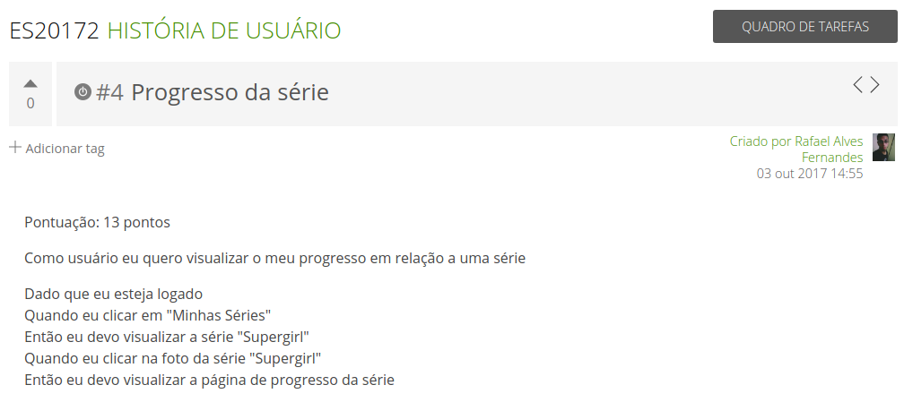
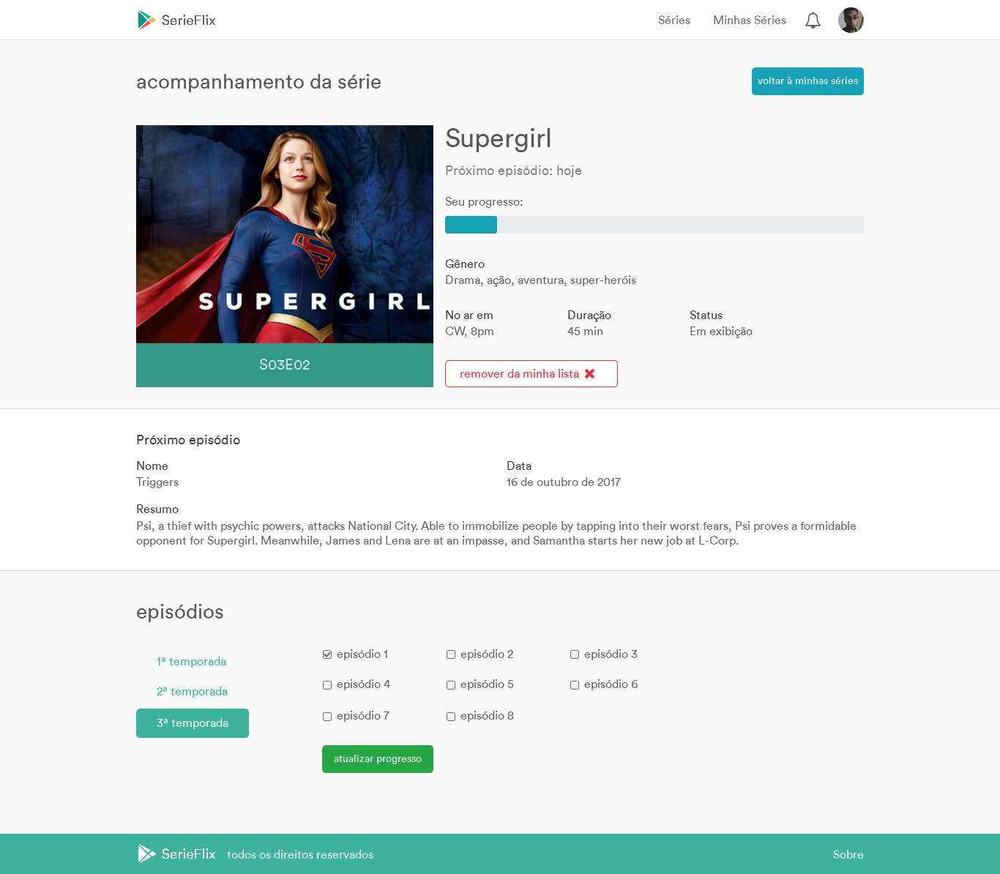

## Stakeholders

O usuário, stakeholder mais presente, possui as dores de não conseguir acompanhar todas as suas séries favoritas e nós desenvolvemos a SerieFlix, uma plataforma online de gestão e acompanhamento de séries, que beneficia o usuário com funcionalidades de marcação de séries favoritas, notificações de novos episódios, acompanhamento do progresso da série, dentre outras para garantir que o usuário nunca mais perca um episódio. A SerieFlix é ideal para fãs de séries que querem se organizar e se manter bem informados.

---

## Arquitetura

Para atender a demanda do cliente e dos usuários, a equipe de desenvolvedores utilizou as tecnologias WEB como HTML 5, CSS 3, JavaScript, Ruby e o Framework Rails. A SerieFlix está hospedada nos servidores em nuvem do Heroku, que utiliza o banco de dados Postgres.

A arquitetura do servidor WEB utilizada foi o MVC (Model-View-Controller). A arquitetura MVC é uma das mais antigas e mais utilizadas atualmente, ela possibilita a divisão do projeto em camadas com responsabilidades muito bem definidas:

- model: possui a responsabilidade de se comunicar com o banco de dados e atender requisições do controller. O model faz parte da camada de persistência que, no nosso projeto, foi utilizado o padrão Active Record, no qual as tabelas do banco de dados relacional são representadas como classes e as linhas da tabela são objetos dessas classes e qualquer recuperação, criação, atualização e exclusão de objetos deve também ser refletida no banco de dados.

- view: possui a responsabilidade de exibir os dados ao usuário que solicitou alguma coisa. É a camada que o usuário interage, geralmente é composta por arquivos HTML, de estilo CSS e de alguma linguagem de script, como JavaScript.

- controller: possui a responsabilidade de processar as requisições do usuário. Ele acessa o model para solicitar dados do banco de dados, encapsula as informações e manda a resposta para a camada view, que apresenta ao usuário o resultado da sua solicitação.

---

## Histórias de Usuário, Pontuação e Cenários

---

---

---

---

---

---

---

## MVP

O MVP do projeto pode ser utilizado no link: https://serieflix.herokuapp.com/

---

## Backlog

---

## Planejamento das Iterações

---

## Telas e Protótipos

---

---

---

---

---

---

---

---

## Storyboard

O storyboard do projeto pode ser encontrado nesse link: https://xd.adobe.com/view/af694e06-a62e-4afa-968b-22f9acab67c5/

---

## Matriz de Rastreabilidade

---

## Testes de Unidade

---

## Cobertura dos Testes de Unidade

---

## Testes de Validação

---

## Execução dos Testes

---

## Uso de Técnicas

---

## Decisões de Projeto

---

## Lições Aprendidas

---

## Aceite do Cliente